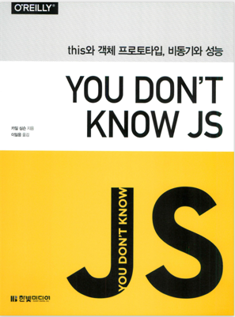

# 📚 숨고 북클럽

## 🐣 You Don’t Know JS: this와 객체 프로토타입, 비동기와 성능



## 📚 스터디 진행방식

```
1. 끝까지 읽는것을 목표!
2. 매주 월요일 오후 7시, 목요일 오후 6시에 진행
3. 매주 정해진 분량을 읽고 자신만의 방식으로 글로 정리해서 올리기
4. 스터디 시간에는 자유롭게 토론
5. Process
  - 각자 읽고 원하는 사람 README 업로드
  - 본인만의 정리
  - 자료 중 참고하면 좋을 것 같은 자료 공유
  - 간단한 발표 or 논의하고 싶은 주제 토론
```

## 🎈(실험ing) md 파일에 대한 템플릿 정의

```
1. 읽은 내용
2. 느낀점
3. 공유하고 싶은 부분(사이트)
```

## 🗓 스터디 일정

| No. | 일시              | 범위                           | 참여자 |
|-----|-----------------|------------------------------| ------------------------ |
| 1   | 7월 28일 (목)       | 29 ~ 38 (2장 this가 이런 거로군! 전까지)                          | Jimmy, Bentley, Daniel, Hayley |
| 2   | 8월 1일 (월)       | ~ 52 (2.3 모든 건 순서가 있는 법 전까지)                          | Jimmy, Bentley, Jessie, Daniel, Linus, Stella, Harry |
| 3   | 8월 4일 (목)       | ~ 66 (3.2 타입 전까지)                          |  ?|
| 4   | 8월 18일 (목)       | ~ 79 (3.3.6 불변성 전까지)                          |Jimmy, Daniel, Linus, Stella, Harry, Hayley  |
| 5   | 8월 22일 (월)       | ~ 92 (4장 클래스와 객체의 혼합 전까지)                          | Harry, Jimmy  |
| 6   | 8월 29일 (월)       | ~ 103 (4.4 믹스인 전까지)                          |  |
| 7   | 9월 1일 (목)       | ~ 118 (5.2 클래스 전까지)                          |  |
| 8   | 9월 5일 (월)       | ~ 128 (5.3 프로토타입 상속 전까지)                          | Daniel, Linus, Jimmy |
| 9   |   -     | ~ 142 (6장 작동 위임 전까지)                          |  |
| 10   | 9월 19일 (목)       | ~ 155 (6.2 클래스 vs 객체 전까지)                          |  |
| 11   | 9월 22일 (목)       | ~ 167 (6.4 더 멋진 구문 전까지)                          |  |
| 12   | 9월 26일 (월)       | ~ 181 (1.2 이벤트 루프 전까지)                          |  |
| 13   | 10월 3일 (월)       | ~ 192 (1.4.2 상호 작용 전까지)                          |  |
| 14   | 10월 6일 (목)       | ~ 206 (2.1 연속성 전까지)                          |  |
| 15   |        | ~ 220 (2.4 콜백을 구하라 전까지)                          |  |
| 16   | 10월 17일 (월)       | ~ 233 (3.1.2 완료 이벤트 전까지)                          |  |
| 17   | 10월 20일 (목)       | ~ 247 (3.3.7 미더운 프라미스? 전까지)                          |  |
| 18   | 10월 24일 (월)       | ~ 261 (3.5 에러 처리 전까지)                          |  |
| 19   | 10월 27일 (목)       | ~ 275 (3.6.4 동시 순회 전까지)                          |  |
| 20   | 10월 31일 (월)       | ~ 286 (3.8.4 타성 전까지)                          |  |
| 21   | 11월 7일 (월)       | ~ 298 (4.1.1 입력과 출력 전까지)                          |  |
| 22   | 11월 10일 (목)       | ~ 311 (4.2.3 제너레이터 이터레이 전까지)                          |  |
| 23   | 11월 14일 (월)       | ~ 325 (4.4.2 제너레이터에서의 프라미스 동시성 전까지)                          |  |
| 24   | 11월 17일 (목)       | ~ 338 (4.6 제너레이터 동시성 전까지)                          |  |
| 25   | ~11월 21일 (월)~       | ~ ~350 (4.8 ES6 이전 제너레이터 전까지)~                          |  |
| 26   | ~11월 24일 (목)~       | ~ ~364 (5.1.3 공유 워커 전까지)~                         |  |
| 27   | ~11월 28일 (월)~       | ~ ~376 (6.1.1 반복 전까지)~                         |  |
| 28   | ~12월 01일 (목)~       | ~ ~388 (6.5 미시성능 전까지)~                         |  |
| 29   | ~12월 05일 (월)~       | ~ ~399 (끝!)~                         |  |


## How to

```bash
# 최초 1회 실행
git clone xxx
```

```bash
git pull origin master
git commit && git push
```

## 스터디 참여자 :sparkles:

<table>
    <tr>
        <td align="center">
            <a href="https://github.com/JinleeJeong">
                
                <br />
                <sub><b>Daniel</b></sub>
            </a>
        </td>
        <td align="center">
            <a href="https://github.com/zeallat">
                
                <br />
                <sub><b>Jimmy</b></sub>
            </a>
        </td>
        <td align="center">
            <a href="https://github.com/dev-hikun">
                
                <br />
                <sub><b>Harry</b></sub>
            </a>
        </td>
        <td align="center">
            <a href="https://github.com/utae">
                
                <br />
                <sub><b>Bentley</b></sub>
            </a>
        </td>
        <td align="center">
            <a href="https://github.com/hyerichung">
                
                <br />
                <sub><b>Hayley</b></sub>
            </a>
        </td>
        <td align="center">
            <a href="https://github.com/yhl0519">
                
                <br />
                <sub><b>Stella</b></sub>
            </a>
        </td>
        <td align="center">
            <a href="https://github.com/JaeEeLee">
                
                <br />
                <sub><b>Jessie</b></sub>
            </a>
        </td>
        <td align="center">
            <a href="https://github.com/moonjunghwan">
                
                <br />
                <sub><b>Linus</b></sub>
            </a>
        </td>
    </tr>
</table>
